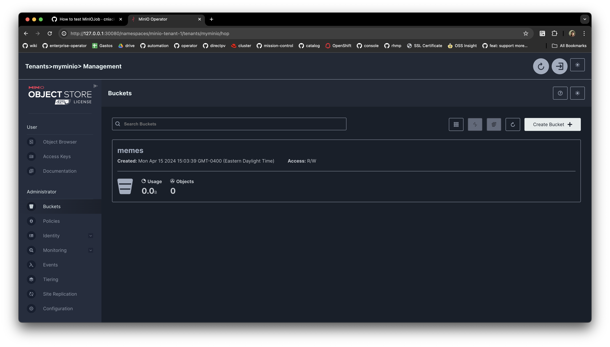

# MinIO Operator v6.0.0 release notes

## About this release

MinIO Operator is the recommended production-ready way to manage MinIO deployments in Kubernetes. This version includes many new features, bug fixes, new Kubernetes base version requirements, deprecations, and more.

## What’s new?

Operator 6.0.0 is now available. This release requires Kubernetes version 1.25.0 or later. If your cluster does not use Kubernetes version 1.25.0 or later, you must upgrade your cluster to before installing or upgrading to Operator v6.0.0+.

* Introducing MinIO Job
* Sidecar container
* TLS refactors
* Operator STS
* `servers` and `volumesPerServer` fields are immutable
* Field `spec.pools.*.name` is required starting v5.0.15
* Headless service port name is now renamed based on TLS settings
* Correctly indicate the proportion of usage of available storage

## Introducing MinIO Job

MinIO Job is designed to manage MinIO using Jobs. Typically, the DevOps team must perform tasks on the fly while deploying MinIO, such as creating a bucket, adding a policy, attaching the policy to a user, and so on.

The current approach requires continuously modifying the existing Tenant CRD, causing it to become more difficult to manage. The new approach distributes these tasks between the Tenant and a new controller by creating an additional MinIO Job CRD.

MinIO Job allows you to manage tasks imperatively through this additional CRD, reducing complexity. It is like controlling things with mc but using a CRD instead of individual commands.

Please review the examples below for a better understanding of this added feature.

### MinIO Job Example (To create a bucket with a Job):

> Assuming that Operator is installed and latest version is used

Deploy `MinIOJob` CRD along with its binded policy:

```yaml
apiVersion: v1
kind: ServiceAccount
metadata:
  name: mc-job-sa
  namespace: minio-tenant-1
---
apiVersion: sts.min.io/v1alpha1
kind: PolicyBinding
metadata:
  name: mc-job-binding
  namespace: minio-tenant-1
spec:
  application:
    serviceaccount: mc-job-sa
    namespace: minio-tenant-1
  policies:
    - consoleAdmin
---
apiVersion: job.min.io/v1alpha1
kind: MinIOJob
metadata:
  name: minio-test-job
  namespace: minio-tenant-1
spec:
  serviceAccountName: mc-job-sa
  tenant:
    name: myminio
    namespace: minio-tenant-1
  commands:
    - op: make-bucket
      args:
        name: memes
```



### Sidecar container

TODO

### TLS Refactor

TODO

### Operator STS 

API `sts.min.io` is updated from `v1alpha1` to `v1beta1`.

The [PolicyBinding](https://github.com/minio/operator/blob/master/docs/policybinding_crd.adoc#k8s-api-github-com-minio-operator-pkg-apis-sts-min-io-v1alpha1-policybinding)
CRD will be backward compatible.
If a resource of type `PolicyBinding` on version `v1alpha` currently exists in the Cluster
at the moment of the upgrade of Operator to Version 6.0.0, the resource will be automatically updated to version `v1beta1`
with no manual intervention.

<details>
  <summary>Example</summary>

Before update:
```yaml
apiVersion: sts.min.io/v1alpha
kind: PolicyBinding
metadata:
  name: binding-1
  namespace: minio-tenant-1
spec:
  application:
    namespace: sts-client
    serviceaccount: stsclient-sa
  policies:
    - test-bucket-rw
```

After update:
```yaml
apiVersion: sts.min.io/v1beta1
kind: PolicyBinding
metadata:
  name: binding-1
  namespace: minio-tenant-1
spec:
  application:
    namespace: sts-client
    serviceaccount: stsclient-sa
  policies:
    - test-bucket-rw
```
</details>

### `servers` and `volumesPerServer` fields are immutable

`spec.pools.*.volumesPerServer` and `spec.pools.*.servers` fields are immutable once created, ensuring the number of servers or volumes in an existing pool does not change. It was introduced in Operator v5.0.15 with PR https://github.com/minio/operator/pull/2070 and is a safety net to prevent potentially dangerous changes to an existing pool. This also matches similar behavior in Operator Console.

To expand storage, add an additional pool.
See [Expand a distributed MinIO Deployment](https://min.io/docs/minio/linux/operations/install-deploy-manage/expand-minio-deployment.html)
for more information.

To reduce storage capacity, remove pools no longer in use by decommissioning them. See [Decommission a Tenant Server Pool](https://min.io/docs/minio/kubernetes/upstream/operations/install-deploy-manage/modify-minio-tenant.html#decommission-a-tenant-server-pool) 
for details.
If a drive is misbehaving or failing, follow the [Drive Failure Recovery](https://min.io/docs/minio/kubernetes/upstream/operations/data-recovery/recover-after-drive-failure.html#minio-restore-hardware-failure-drive)
guide. If a node is failing, follow the [Node Failure Recovery guide](https://min.io/docs/minio/kubernetes/upstream/operations/data-recovery/recover-after-node-failure.html).

### Field `spec.pools.*.name` is required starting v5.0.15

TODO

### Field `spec.credsSecret` is removed

Field .spec.credsSecret was removed in favor of .spec.configuration, this secret should hold all the environment variables for the MinIO deployment that contain sensitive information and should not be shown on .spec.env.

The content of .spec.credsSecret was custom credentials (access key and secret key) to the Tenant, now those credentials are stored in .spec.configuration instead.

### Headless service port name is now renamed based on TLS settings

If TLS is enabled, the Headless service port name is now `https-minio` instead of `http-minio`. Be sure to update your Ingress configuration or other resources that reference the port name.

When `.spec.requestAutocert` is `false` and `.spec.externalCertSecret` is empty, then no TLS encryption in transit 
(https) is enabled for the tenant. The 3 services created in the namespace have a prefix `http-` for the service port:

`{tenant-name}-console` exposes port `http-console`

<details>
  <summary> example</summary>

```yaml
apiVersion: v1
kind: Service
metadata:
  labels:
    v1.min.io/console: tenant-1-console
  name: tenant-1-console
  namespace: tenant-1
spec:
  allocateLoadBalancerNodePorts: true
  clusterIP: 10.96.78.111
  clusterIPs:
  - 10.96.78.111
  internalTrafficPolicy: Cluster
  ipFamilies:
  - IPv4
  ipFamilyPolicy: SingleStack
  ports:
  - name: http-console
    nodePort: 30984
    port: 9090
  selector:
    v1.min.io/tenant: tenant-1
  type: LoadBalancer
```
</details>

Similarly, `minio` exposes port `http-minio` and headless service `{tenant-name}-hl` exposes port `http-minio`.

However, when TLS is enabled (because of `.spec.requestAutocert` is `true` or `.spec. externalCertSecret` is provided)
then the port names for  `{tenant-name}-console` and `minio` services were renamed to have prefix `https-`.

<details>
  <summary> example</summary>

```yaml
apiVersion: v1
kind: Service
metadata:
  labels:
    v1.min.io/console: tenant-1-console
  name: tenant-1-console
  namespace: tenant-1
spec:
  allocateLoadBalancerNodePorts: true
  clusterIP: 10.96.78.111
  clusterIPs:
  - 10.96.78.111
  internalTrafficPolicy: Cluster
  ipFamilies:
  - IPv4
  ipFamilyPolicy: SingleStack
  ports:
  - name: https-console
    nodePort: 32368
    port: 9443
  selector:
    v1.min.io/tenant: tenant-1
  type: LoadBalancer
```
</details>

Headless service port was not renamed, it was kept as `http-minio`, starting Operator version 6.0.0 the 3 services behave
the same way and rename the port with a `https-` prefix.


